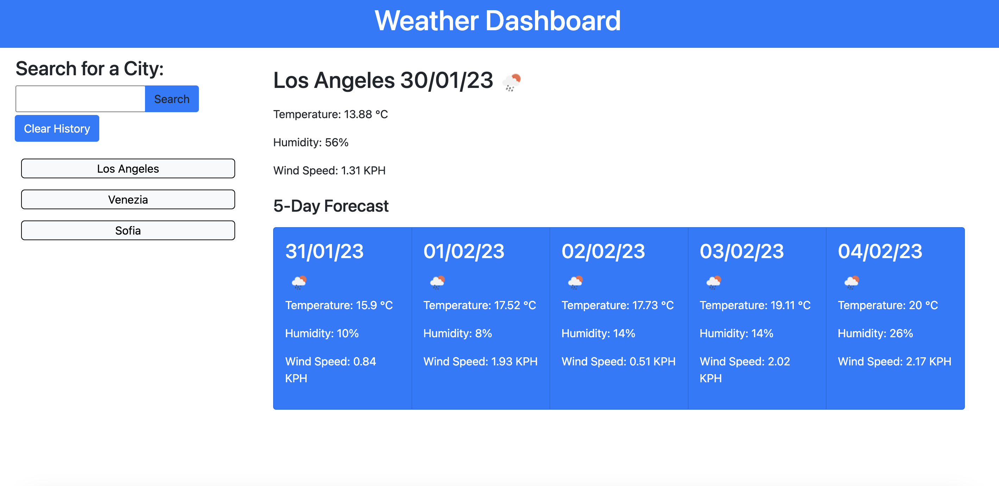
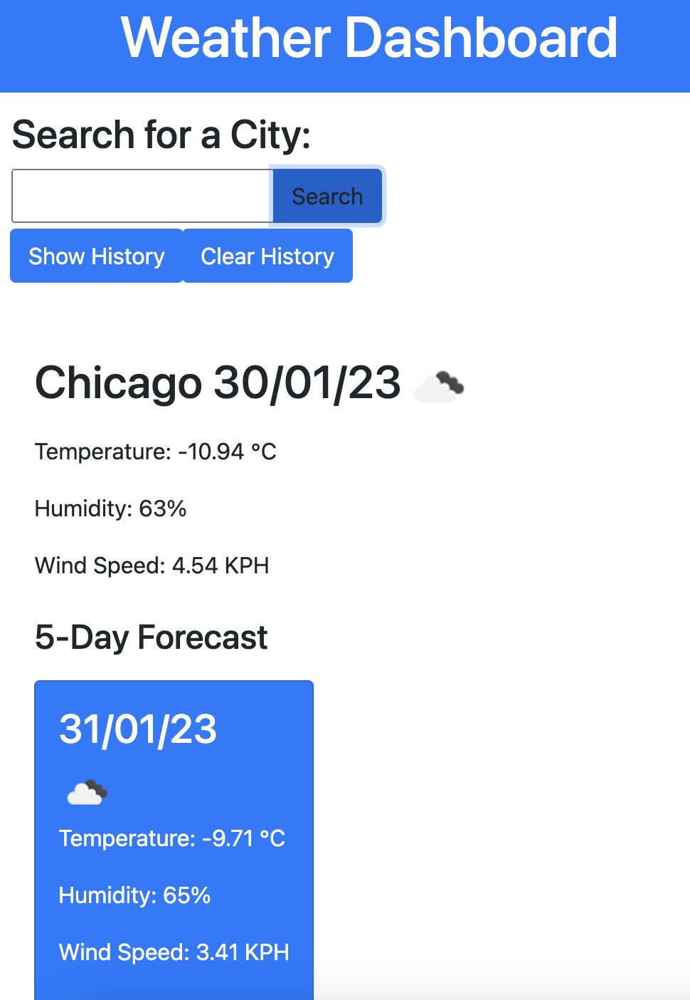

# Weather-Dashboard

## Description

A handy 5-day forecast weather dashboard

## Usage

This weather dashobaord allows the
 user to check the weather anywhere in world. Upon entering a city name in the search box and hitting 'Search', the current weather condition in that city will be displyed. A 5-day forecast will also be displayed underneath.

The parameters checked are: temperature, wind speed, humidity.

An icon will also represent the relevant weather conditions (sunny, rainy, cloudy, etc.).

A search history is available on larger screens. The cities are sorted in chronological order from the most recent to the oldest. The maximum number of saved cities is 10. If this limit is reached, the oldest entry will be deleted.

The search history will be collapsed in smaller screens for better usability but it can be accessed via the 'Show History' button.

The user can reset the history by hitting 'Clear History'. 

The application also prevents any duplicate cities from being added to the History.

### Built with

- HTML & CSS
- Bootstrap
- JavaScript
- jQuery
- jQueryUI
- Moment.js
- [Open Weather API] (https://openweathermap.org/)